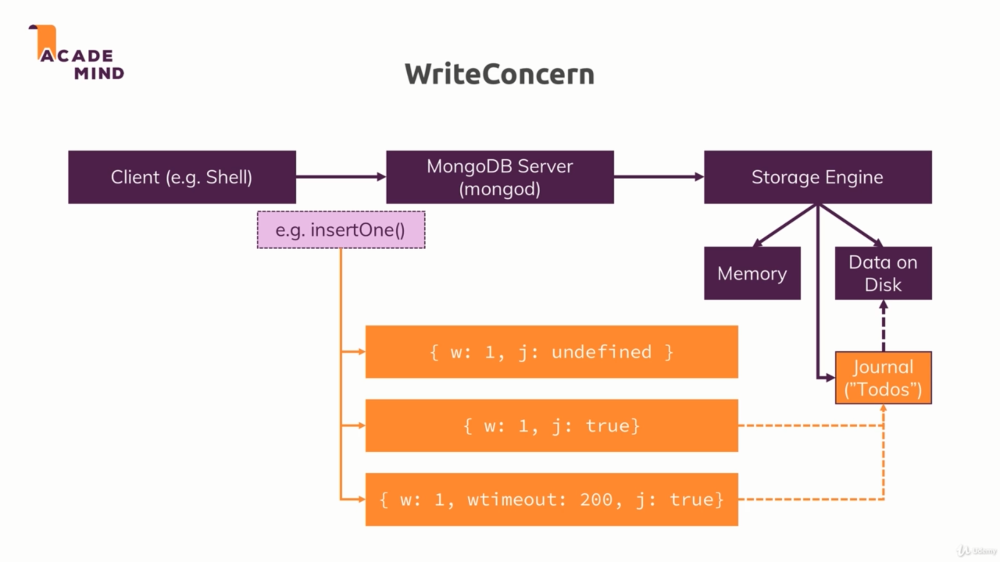
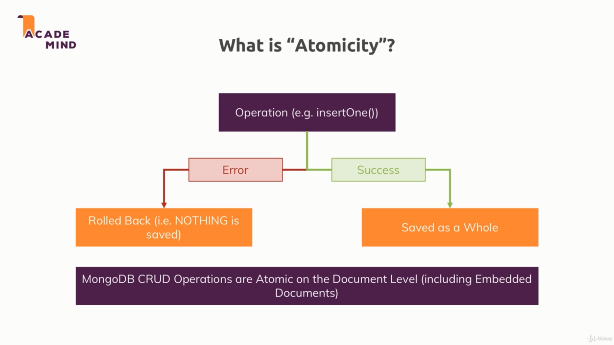
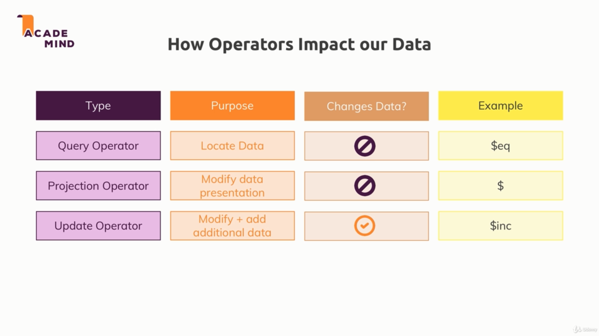
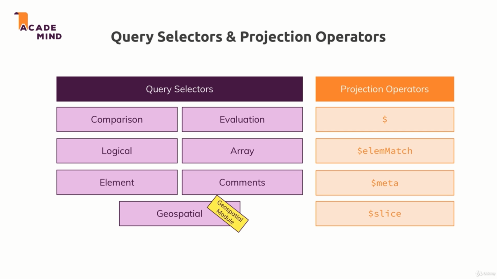
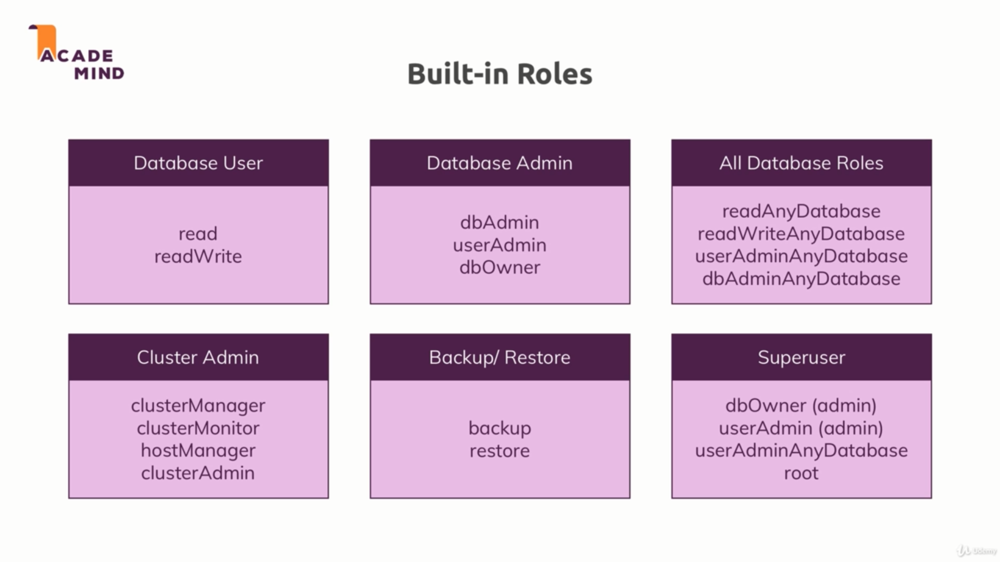
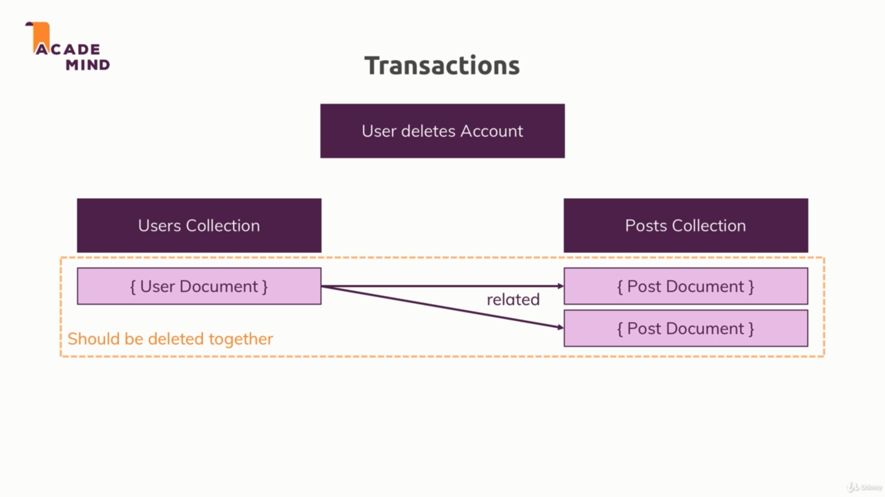

mongo shell is based on javascript 
1.mongo // to access to mongo shell
2.show databases // for show all dbs except that doesn't have any collection and data
3.use <db name> // for connect to existing or doesn't existing db . if that doesn't exist that will be create.(e.g:use shop)
4.db.<collection name>.insertOne({<your key without or with quotation mark>:"<your value>"(,<<your key without or with quotation mark>:"<your value>">(,<<your key without or with quotation mark>:"<your value>">(,<<your key without or with quotation mark>:"<your value>">)))}) // this is for insert document to collection if your collection doesn't exist mongo will create it (e.g: db.products.insertOne({name:"shampoo"})  or  db.products.insertOne({"name":"shampoo",price:12.99})  )//mongodb always generate for you an id as _id this is a uniq id but if you want to you can change that field and write your id but be careful if you write a duplicate id mongodb would return to you an error 
5.db.<collection name>.find()//if you don't insert any thing to find this will give you all document that would find (e.g:db.products.find() ) // this command would not gave you all document it just gave you a cursor but you can add .toArray to it till that would gave you all documents in an array // 
db.<collection name>.find().toArray() // db.<collectionName>.find().forEach() this command allow you do query like code //e.g : db.passengers.find().forEach((a)=>{printjson(a)}) //printjson is a function in mongodb // db.passengers.find().forEach((a)=>{printjson(a.age)})  

Projection:
in find method you can do Projection by using find actually in Projection you says which key and value you wanna gets
db.<collectionName>.find({},{name:1}) // this command would gave us all documents with _id and name 
if you wanna just see their  names you must type this command :db.<collectionName>.find({},{name:1,_id:0})

#important : if you wanna access to nested documents you show that with . to access child but you must put all field into quotation marks e.g: db.<collection name>.find({"status.description":"10 miles away"})

6.<any thing>.pretty() // this will give you this feature that can you easily to read and pretty version
7.cls // if you want to clear your mongo bash this command will help you to do that  

create:
insertOne(data,options)
insertMany(data,options)
insert() //this is for old approach and this is not a good approach this method work with either to previous method but with different result 

Options:
1.ordered:in insertMany for default ordered is true and it's means if some of the insert document got an error the rest of documents must be failed even if they are not have error with them just those are before document with error but when you changed to false all would be inserted except those have error // e.g: db.<collectionName>.insertMany([{_id:"yoga",name:"Yoga"},{_id:"gym",name:"Gym"},{_id:"cooking",name:"Cooking"}],{ordered:false})
2.writeConcern:this option actually give a control on your response               
db.<collectionName>.insertOne({name:"chrissy",age:41},{writeConcern:{w:0}}) : in this example this will return to you acknowledged:false even though it actually inserted this document but this would be not wait for response this is very fast but it might be some of data got lost 
db.<collectionName>.insertOne({name:"chrissy",age:41},{writeConcern:{w:1}}) : this is default behavior 
db.<collectionName>.insertOne({name:"chrissy",age:41},{writeConcern:{w:1,j:true}}) : this will be waiting for journal so it would be little bit slower than before 
db.<collectionName>.insertOne({name:"chrissy",age:41},{writeConcern:{w:1,j:false}}) : this is default behavior  
db.<collectionName>.insertOne({name:"chrissy",age:41},{writeConcern:{w:1,j:false,wtimeout:200}}) : this option can give the operation a timeOut that allow to wait for response

3.Atomicity: when we insert a document or multiple docs mongo db will ensure that whole of one doc will be insert or none of element in doc will insert 
this ensure is just for doc level

*********************************************** read ***************************************************:
find(filter,options)
findOne(filter,options)
db.<collectionName>.<method(like find)>(<filter({field:value})>)
db.<collectionName>.<method(like find)>(<filter({field:{operator:value}})>)

search in embedded documents inside an object field would be like this : "rating.total.average" e.g: 
{
  "_id":ObjectId("51451515151644484847"),
  "rating":{
    "total":{
      "average":50
    }
  }
}
db.<collectionName>.find({"rating.total.average": 50})

search in array that some value contain in array it would be same as regular element e.g:
db.<collectionName>.find({"genre": "Drama"})
{
  "_id":ObjectId("51451515151644484847"),
  "genre":[
    "Drama",
    "Action",
    "Anime",
    "Horror"
  ]
}
but when we wanna an array contain with one element we would treat like this e.g:
db.<collectionName>.find({"genre": ["Drama","Action"]})
{
  "_id":ObjectId("51451515151644484847"),
  "genre":[
    "Drama",
    "Action"
  ]
}
but this would not return array with opp order like this

{
  "_id":ObjectId("51451515151644484847"),
  "genre":[
    "Action",
    "Drama"
  ]
}
if we wanna return with don't care about order we have to use find like this 
db.<collectionName>.find({"genre": {$all: ["Drama","Action"]} })

$elemMatch
if we wanna search in array that contain object or something els :
db.<collectionName>.find({"hobbies": {$elemMatch: {title:"Sports",frequency:{$gte:3}}} })
this would return something like this 
{
  "_id":ObjectId("484623135646844631554648"),
  "name":"Max",
  "hobbies":[
    {
      "title":"Sports",
      "frequency":3
    },
    {
      "title":"Cooking",
      "frequency":6
    }
  ],
  "phone":094152044884
}

Operators:

comparison Operators:

* $eq	Matches values that are equal to a specified value.
* $gt	Matches values that are greater than a specified value.
* $gte	Matches values that are greater than or equal to a specified value.
* $in	Matches any of the values specified in an array.e.g: db.<collectionName>.find({"runtime": {$in: {[35,42]}}})
* $nin	Matches none of the values specified in an array.e.g: db.<collectionName>.find({"runtime": {$nin: {[35,42]}}})
* $lt	Matches values that are less than a specified value.
* $lte	Matches values that are less than or equal to a specified value.
* $ne	Matches all values that are not equal to a specified value. 

logical operators:

* $and Matches all any of these condition inside array but with or law actually it should have several condition at same time.e.g: db.<collectionName>.find({$and:[{"runtime": {$nin: {[35,42]}}},{"runtime":35}]) --------- we have an alternative for this operator we can use this without and operator like this : db.<collectionName>.find({"runtime": {$nin: {[35,42]}},{"runtime":35}})
* $not when we add not to any operators it would return opp of that result e.g: db.<collectionName>.find({"runtime": {"$not":{"$nin": {[35,42]}}}})
* $nor (opp of $or )not Matches all any of these condition inside array but with or low.e.g: db.<collectionName>.find({$nor:[{"runtime": {$nin: {[35,42]}}},{"runtime":37}])
* $or Matches all any of these condition inside array but with or law.e.g: db.<collectionName>.find({$or:[{"runtime": {$nin: {[35,42]}}},{"runtime":37}])

element operators:

* exists will give you all doc that contain that specific element e.g: db.getCollection("imi_sub_3080_316").find({"test":{"$exists":true}})
* type will give you all doc that contain that specific element type e.g: db.getCollection("imi_sub_3080_316").find({"phone":{"$type":"number"}}) we can also specify multiple type like this db.getCollection("imi_sub_3080_316").find({"phone":{"$type":["double","number"]}})
  
Double	1	“double”	 
String	2	“string”	 
Object	3	“object”	 
Array	4	“array”	 
Binary data	5	“binData”	 
Undefined	6	“undefined”	Deprecated.
ObjectId	7	“objectId”	 
Boolean	8	“bool”	 
Date	9	“date”	 
Null	10	“null”	 
Regular Expression	11	“regex”	 
DBPointer	12	“dbPointer”	Deprecated.
JavaScript	13	“javascript”	 
Symbol	14	“symbol”	Deprecated.
JavaScript (with scope)	15	“javascriptWithScope”	 
32-bit integer	16	“int”	 
Timestamp	17	“timestamp”	 
64-bit integer	18	“long”	 
Decimal128	19	“decimal”	New in version 3.4.
Min key	-1	“minKey”	 
Max key	127	“maxKey”

evaluation operators:

* $expr allows use off aggregation within the query language ... it useful for compare two element in 1 document e.g:
  db.sales.find({$expr:{$gt:["$volume","$target"]}}) this just return all doc that are volume element grater than target element 
  another example : db.sales.find({$expr:{$gt: [{$cond: {if: {$gte: ["$volume",190] }, then: {$subtract: ["$volume",10]}, else: "$volume" } }, "$target" ] }})
* $jsonSchema validate documents against the given JSON Schema
* $mod performs a modulo operation on the value of a field and selects documents with a specified result 
* $regex Selects documents where values match a specified regular expression 
    { <field>: { $regex: /pattern/, $options: '<options>' } }
    { <field>: { $regex: 'pattern', $options: '<options>' } }
    { <field>: { $regex: /pattern/<options> } }

    { name: { $regex: /acme.*corp/i, $nin: [ 'acmeblahcorp' ] } }
    { name: { $regex: /acme.*corp/, $options: 'i', $nin: [ 'acmeblahcorp' ] } }
    { name: { $regex: 'acme.*corp', $options: 'i', $nin: [ 'acmeblahcorp' ] } }

    { name: { $regex: '(?i)a(?-i)cme' } }

    db.inventory.find( { item: { $not: { $regex: "^p.*" } } } )
    db.inventory.find( { item: { $not: { $regex: /^p.*/ } } } ) 

    db.inventory.find( { item: { $not: /^p.*/ } } )
* $text performs text search 
* $where Matches documents that satisfy a JavaScript expression 

** important querying Arrays

1. when you wanna have this document with filtering title:
{
  "_id":ObjectId("484623135646844631554648"),
  "name":"Max",
  "hobbies":[
    {
      "title":"Sports",
      "frequency":3
    },
    {
      "title":"Cooking",
      "frequency":6
    }
  ],
  "phone":094152044884
}
you must search for hobbies.title like this 
db.users.find({"hobbies.title": "Sports" })

1. if you wanna just filter size of array you can use $size e.g:db.users.find({hobbies: {$size:3} })

2. if we wanna search in array that contain object or something els :
db.<collectionName>.find({"genre": {$elemMatch: {title:"Sports",frequency:{$gte:3}}} })
this would return something like this 
{
  "_id":ObjectId("484623135646844631554648"),
  "name":"Max",
  "hobbies":[
    {
      "title":"Sports",
      "frequency":3
    },
    {
      "title":"Cooking",
      "frequency":6
    }
  ],
  "phone":094152044884
}

**Sort,Skip,Limit:
we can sort and skip and limit our result like this db.movies.find().sort({"rating.average":1,runtime:-1}).skip(100).limit(10)

**Projection and shape our results:

db.movies.find({},{name:1,genres:1, runtime:1,rating:1})
this will return all data we mention it and plus _id which is an exception if you wanna exclude the _id you must mention it e.g:
db.movies.find({},{name:1,genres:1, runtime:1,rating:1,_id:0})

$slice
you want first 2 element of an array you must use slice for projection:
db.<collectionName>.find({ },{genres:{$slice: 2 } , name:1 })
you can skip it too
db.<collectionName>.find({ },{genres:{$slice: [<number of you wanna skip >,<number of slice>] } , name:1 })

* indexing text
db.<collectionName>.createIndex({"<fieldName>":"text"(ascending and if you put -1 it became descending)})

when you wanna search into indexes :
db.<collectionName>.find({$text:{$search: "book"}}) this will search into all indexes
{
  "_id":ObjectId("55987552144887s855f47"),
  "title":"A Book",
  "description":"this is an awesome book about a young artist!"
}
db.<collectionName>.find({$text:{$search: "red book"}}) 
{
  "_id":ObjectId("55987552144887s855f47"),
  "title":"A Book",
  "description":"this is an awesome book about a young artist!"
}
{
  "_id":ObjectId("848477846311578484489"),
  "title":"Red T-Shirt",
  "description":"this is T-Shirt is red and it's pretty awesome!"
}
db.<collectionName>.find({$text:{$search: "\"red book\""}})  when you are looking exact phrase 

return nothing 

db.<collectionName>.find({$text:{$search: "\"awesome book\""}})
{
  "_id":ObjectId("55987552144887s855f47"),
  "title":"A Book",
  "description":"this is an awesome book about a young artist!"
}

you can also sort that 

db.<collectionName>.find({$text:{$search: "awesome t-shirt"},{score:{$meta:"textScore"}}}) 
{
  "_id":ObjectId("848477846311578484489"),
  "title":"Red T-Shirt",
  "description":"this is T-Shirt is red and it's pretty awesome!",
  "score":1.7999999999999999999999998
}

{
  "_id":ObjectId("55987552144887s855f47"),
  "title":"A Book",
  "description":"this is an awesome book about a young artist!",
  "score":0.625
}

db.<collectionName>.find({$text:{$search: "awesome t-shirt"},{score:{$meta:"textScore"}}}).sort({score:{$meta:"textScore"}})
{
  "_id":ObjectId("848477846311578484489"),
  "title":"Red T-Shirt",
  "description":"this is T-Shirt is red and it's pretty awesome!",
  "score":1.7999999999999999999999998
}
{
  "_id":ObjectId("55987552144887s855f47"),
  "title":"A Book",
  "description":"this is an awesome book about a young artist!",
  "score":0.625
}

** you can add combined text
first you have to delete previous text indexes then :
db.<collectionName>.createIndex({"<fieldName>":"text","<fieldName>":"text"})

you can also exclude words from your search:
without excluding
db.<collectionName>.find({$text:{$search: "awesome "}})
{
  "_id":ObjectId("848477846311578484489"),
  "title":"Red T-Shirt",
  "description":"this is T-Shirt is red and it's pretty awesome!"
}
{
  "_id":ObjectId("55987552144887s855f47"),
  "title":"A Book",
  "description":"this is an awesome book about a young artist!"
}
with excluding
db.<collectionName>.find({$text:{$search: "awesome -t-shirt"}})
{
  "_id":ObjectId("848477846311578484489"),
  "title":"Red T-Shirt",
  "description":"this is T-Shirt is red and it's pretty awesome!"
}
{
  "_id":ObjectId("55987552144887s855f47"),
  "title":"A Book",
  "description":"this is an awesome book about a young artist!"
}

** setting the default language and using weights
db.<collectionName>.createIndex({"<fieldName>":"text","<fieldName>":"text"},{default_language:"english",weights:{title:1,description:"10"}})

db.<collectionName>.find({$text:{$search: "",$language:"german",$caseSensitive:true}})

*********************************************** update ***************************************************:
update(filter,data,options)
updateOne(filter,data,options)
updateMany(filter,data,options)
replaceOne(filter,data,options)

db.<collectionName>.updateOne(filter,data,options) // e.g : db.<collectionName>.updateOne({name:"shampoo"},{$set:{marker:"toDelete"}}) //this command will find first document and update that
db.<collectionName>.updateMany(filter,data,options) // e.g : db.<collectionName>.updateMany({},{$set:{marker:"toDelete"}}) // this command will find all documents and set marker field to them or change marker fields

* $currentDate	Sets the value of a field to current date, either as a Date or a Timestamp.
  
* $inc	Increments the value of the field by the specified amount.
db.<collectionName>.updateOne({name:"Manuel"},{$inc:{age:2}}) // this command find document and increase the field by 2
db.<collectionName>.updateOne({name:"Manuel"},{$inc:{age:-2}}) // this command find document and increase the field by 2
  
* $min	Only updates the field if the specified value is less than the existing field value.
db.<collectionName>.updateOne({name:"Manuel"},{$min:{age:35}}) // if age was grater than 35 then it would changed to 35 but if it was little than 35 it wont be changed

* $max	Only updates the field if the specified value is greater than the existing field value.
db.<collectionName>.updateOne({name:"Manuel"},{$max:{age:35}}) // if age was little than 35 then it would changed to 35 but if it was grater than 35 it wont be changed
  
* $mul	Multiplies the value of the field by the specified amount.
db.<collectionName>.updateOne({name:"Manuel"},{$mul:{age:1.1}}) 

* $rename	Renames a field.
  
* $set	Sets the value of a field in a document.and it does not override document
e.g : db.<collectionName>.updateOne({name:"shampoo"},{$set:{marker:"toDelete"}}) //this command will find first document and update that

* $setOnInsert	Sets the value of a field if an update results in an insert of a document. Has no effect on update operations that modify existing documents.it just means when upsert option would be true
e.g : db.<collectionName>.updateOne({name:"shampoo"},{$setOnInsert:{marker:"toDelete"}},{upsert:true}) 

* $unset	Removes the specified field from a document.
e.g : db.<collectionName>.updateOne({name:"shampoo"},{$unset:{marker:""}}) 

* $rename Rename the specified field from a document.
e.g : db.<collectionName>.updateOne({},{$rename:{age:"totalAge"}}) 

**** Update Array ****

if we had document like this :
{
  "_id":ObjectId("2659846315484887"),
  "name":"Chris",
  "hobbies":[
    {
      "title":"Sports",
      "frequency":3
    },
    {
      "title":"Cooking",
      "frequency":6
    }
  ],
  "isSporty":true
}
db.<collectionName>.updateMany({hobbies:{ $elemMatch: {title:"Sports",frequency: {$gte: 3 } } } , {$set: {"hobbies.$"(this will give up that we already found):{title:"Sport",frequency:7}  } } }) this command will override document

db.<collectionName>.updateMany({hobbies:{ $elemMatch: {title:"Sports",frequency: {$gte: 3 } } } , {$set: {"hobbies.$.highFrequency"(this will update that specified filed and if that field wasn't exist give you a new field):true  } } }) this command will override document

db.<collectionName>.updateMany({hobbies:{ $elemMatch: {title:"Sports",frequency: {$gte: 3 } } } , {$set: {"hobbies.$[].highFrequency"(this will update that specified filed in foreach array element and if that field wasn't exist give you a new field):true  } } }) this command will override document

db.<collectionName>.updateMany({"hobbies.frequency":{$gt: 2 }} ,{$set: {"hobbies.$[el].goodFrequency":true } }, {arrayFilters: [ {"el.frequency":{$gt:2}} ] }) // with this command you can specify the element you want to update

* adding elements to Arrays
db.<collectionName>.updateOne({name: "Maria}, {$push:{hobbies:{title:"Sports",frequency:2}}})
db.<collectionName>.updateOne({name: "Maria}, {$addToSet:{hobbies:{title:"Sports",frequency:2}}}) // difference between addToSet and push is that push would add duplicate but we had that element addToSet wouldn't add duplicate 
db.<collectionName>.updateOne({name: "Maria"},{$push: {hobbies:{$each:[{title:"Good Wine",frequency:1},{title:"Hiking",frequency:2}],$sort:{frequency:-1},$slice:1}}})

* removing elements from Arrays
db.<collectionName>.updateOne({name: "Maria}, {$pull:{hobbies:{title:"Sports",frequency:2}}})
db.<collectionName>.updateOne({name: "Maria}, {$pop:{hobbies:1}}) when you wanna remove last element
db.<collectionName>.updateOne({name: "Maria}, {$pop:{hobbies:-1}}) when you wanna remove first element

*********************************************** delete ***************************************************:

delete:
deleteOne(filter,options)
deleteMany(filter,options)

db.<collectionName>.deleteOne({fileter},{option})
db.<collectionName>.deleteMany({fileter},{option})
db.<collectionName>.drop()
db.dropDatabase()

*********************************************** index ***************************************************:
db.<collectionName>.find().explain()
db.<collectionName>.explain().find()
db.<collectionName>.explain("queryPlanner").find()
db.<collectionName>.explain("executionStats").find()
db.<collectionName>.explain("serverInfo").find()
queryPlanner, which details the plan selected by the query optimizer and lists the rejected plans;
executionStats, which details the execution of the winning plan and the rejected plans; and
serverInfo, which provides information on the MongoDB instance.

db.<collectionName>.createIndex({"<fieldName>":1(ascending and if you put -1 it became descending)}) ** this would create index in foreground  if you wanna create index in background use it like this:

db.<collectionName>.createIndex({<fieldName>:1},{background:true})

db.<collectionName>.createIndex({"<fieldName>":"text"(ascending and if you put -1 it became descending)})
db.<collectionName>.dropIndex({"<fieldName>":1(ascending and if you put -1 it became descending)})

* indexes could be compound of multi fields 
db.<collectionName>.createIndex({"<fieldName>":1,<fieldName>:1}) it would create one index but with 2 value

* if you wanna see all indexes in a collection
db.<collectionName>.getIndexes()

* Configuring Indexes

* unique
db.<collectionName>.createIndex({email(this would be new index):1},{unique:true})

* partial filter 
db.<collectionName>.createIndex({"dob.age"(this would be new index):1},{partialFilterExpression:{gender:"male})
e.g : db.<collectionName>.createIndex( 
  { age: 1}, 
  { partialFilterExpression: { age: { $gte: 18 }, lastname: { $exists: true }}
);

* TTL (Time-To-Live)
db.<collectionName>.createIndex({createdAt:1},{expireAfterSeconds:10(time TO second)}) after this time mongo will delete document 
point is this option is just work for single field app and just for date time 

* text index
  
db.<collectionName>.createIndex({"<fieldName>":"text"(ascending and if you put -1 it became descending)})

when you wanna search into indexes :
db.<collectionName>.find({$text:{$search: "book"}}) this will search into all indexes
{
  "_id":ObjectId("55987552144887s855f47"),
  "title":"A Book",
  "description":"this is an awesome book about a young artist!"
}
db.<collectionName>.find({$text:{$search: "red book"}}) 
{
  "_id":ObjectId("55987552144887s855f47"),
  "title":"A Book",
  "description":"this is an awesome book about a young artist!"
}
{
  "_id":ObjectId("848477846311578484489"),
  "title":"Red T-Shirt",
  "description":"this is T-Shirt is red and it's pretty awesome!"
}
db.<collectionName>.find({$text:{$search: "\"red book\""}})  when you are looking exact phrase 

return nothing 

db.<collectionName>.find({$text:{$search: "\"awesome book\""}})
{
  "_id":ObjectId("55987552144887s855f47"),
  "title":"A Book",
  "description":"this is an awesome book about a young artist!"
}

you can also sort that 

db.<collectionName>.find({$text:{$search: "awesome t-shirt"},{score:{$meta:"textScore"}}}) 
{
  "_id":ObjectId("848477846311578484489"),
  "title":"Red T-Shirt",
  "description":"this is T-Shirt is red and it's pretty awesome!",
  "score":1.7999999999999999999999998
}

{
  "_id":ObjectId("55987552144887s855f47"),
  "title":"A Book",
  "description":"this is an awesome book about a young artist!",
  "score":0.625
}

db.<collectionName>.find({$text:{$search: "awesome t-shirt"},{score:{$meta:"textScore"}}}).sort({score:{$meta:"textScore"}})
{
  "_id":ObjectId("848477846311578484489"),
  "title":"Red T-Shirt",
  "description":"this is T-Shirt is red and it's pretty awesome!",
  "score":1.7999999999999999999999998
}
{
  "_id":ObjectId("55987552144887s855f47"),
  "title":"A Book",
  "description":"this is an awesome book about a young artist!",
  "score":0.625
}

** you can add combined text
first you have to delete previous text indexes then :
db.<collectionName>.createIndex({"<fieldName>":"text","<fieldName>":"text"})

you can also exclude words from your search:
without excluding
db.<collectionName>.find({$text:{$search: "awesome "}})
{
  "_id":ObjectId("848477846311578484489"),
  "title":"Red T-Shirt",
  "description":"this is T-Shirt is red and it's pretty awesome!"
}
{
  "_id":ObjectId("55987552144887s855f47"),
  "title":"A Book",
  "description":"this is an awesome book about a young artist!"
}
with excluding
db.<collectionName>.find({$text:{$search: "awesome -t-shirt"}})
{
  "_id":ObjectId("848477846311578484489"),
  "title":"Red T-Shirt",
  "description":"this is T-Shirt is red and it's pretty awesome!"
}
{
  "_id":ObjectId("55987552144887s855f47"),
  "title":"A Book",
  "description":"this is an awesome book about a young artist!"
}

** setting the default language and using weights
db.<collectionName>.createIndex({"<fieldName>":"text","<fieldName>":"text"},{default_language:"english",weights:{title:1,description:"10"}})

db.<collectionName>.find({$text:{$search: "",$language:"german",$caseSensitive:true}})

* adding a Geospatial index
db.<collectionName>.createIndex({<yourFieldName>:"2dsphere})

*********************************************** Geospatial ***************************************************:

first you have to add special index to it
* adding a Geospatial index
db.<collectionName>.createIndex({<yourFieldName>:"2dsphere})

db.<collectionName(anything you want)>.insertOne({<fieldName(anything you want)>:"<anyNameYouWant>",<fieldName(anything you want)>:{ type<it has to be type>:"Point<it has to be valid type of geo data support by mongodb>",coordinates<it has to be coordinates>:[<longitude> , <Latitude>] }})

* list of valid type of geo data in mongo
Point
LineString
Polygon
MultiPoint
MultiLineString
MultiPolygon
GeometryCollection

db.<collectionName>.find({<fieldName>: {$near: {$geometry: {type: "Point", coordinates: [<longitude> , <Latitude>] },$maxDistance: <distance to meter>,$minDistance:<distance to meter> } } })

* finding places inside a certain area
db.<collectionName>.find({location:{$geoWithin: {$geometry : { type: "Polygon" }, coordinates: [[ <corrdinate1(mean array of longitude and Latitude)>,<corrdinate2>,<corrdinate3>,<corrdinate4>,<corrdinate1> ]] } }}) // polygon need to be end with start point

* if you have polygon inside DB this method help you find user is inside a specific area
db.<collectionName>.find({ area: {$geoIntersects:{ $geometry:{ type:"Point",coordinates: [ longitude , Latitude ] } }} })

* finding places within a certain Radius
db.<collectionName>.find({ location: {$geoWithin: {$centerSphere: [ [<longitude> , <Latitude>], <Radius to radians> ]  } } })

8.show collections // this command will give you list of all collections that db you have used
9.db.<collectionName>.deleteOne(filter,options) // e.g : db.products.deleteOne({name:"shampoo"}) // this command will find all documents and delete them
10.db.<collectionName>.deleteMany(filter,options) // e.g : db.products.deleteMany({marker:"toDelete"}) // this command will find all documents and delete them

11.db.<collectionName>.updateOne(filter,data,options) // e.g : db.<collectionName>.updateOne({name:"shampoo"},{$set:{marker:"toDelete"}}) //this command will find first document and update that
12.db.<collectionName>.updateMany(filter,data,options) // e.g : db.<collectionName>.updateMany({},{$set:{marker:"toDelete"}}) // this command will find all documents and set marker field to them or change marker fields

13.db.<collectionName>.insertMany(<data as array>,options) // e.g : db.products.insertMany([{"name" : "shampoo3", "price" : 14.15},{"name" : "shampoo4", "price" : 16.15}]) this will enter whole array to this collection

14.db.<collectionName>.find({distance: {$gt:10000}}) // all $ reserved by mongodb and do an action this case tell us find for me all documents that the distance is be grater than 10000 this characters called Comparison Query Operators

* $eq	Matches values that are equal to a specified value.
* $gt	Matches values that are greater than a specified value.
* $gte	Matches values that are greater than or equal to a specified value.
* $in	Matches any of the values specified in an array.
* $lt	Matches values that are less than a specified value.
* $lte	Matches values that are less than or equal to a specified value.
* $ne	Matches all values that are not equal to a specified value.
* $nin	Matches none of the values specified in an array.

15.db.<collectionName>.update(filter,data,options) // e.g : db.<collectionName>.update({name:"shampoo"},{marker:"toDelete"}) // this command will work without $set but this command will replace all object with this new object
16.db.<collectionName>.replaceOne(filter,data,options) // this command is as like as update command 

17.in mongo we can have date and time stamps also we can have array and object// e.g:db.<collectionName>.insertOne({name:"apple",isStartup:true,funding:1234567890123456789(we cannot store this number if you wanna store number you must use strings or multiple field for that),details:{ceo:"mark super"},tags:[{title:"super"},{title:"perfect"},10,"all"],foundingDate:new Date(),insertedAt: new Timestamp()})

18.db.stats() // this command will give you information about DB
19.typeof db.<collectionName>.findOne({}).<fieldName> // this command will gave you type of the thing that return: e.g:typeof db.passengers.findOne({}).name
20.db.<collectionName>.aggregate([{$lookup:{from:<nameOfAnotherCollectionThatHaveRelationWithUs>,localField:<theNameOfTheLocalFieldThatContainAuthorsKeys>,foreignField:<theNameOfTheForienFieldThatContainAuthors>,as:<theNameThatYouWannaDisplayAsNewField>}}])// if you wanna have relation and you wanna show that first you must implement aggregate framework  e.g: db.books.aggregate([{$lookup:{from:"authors",localField:"authors",foreignField:"_id",as:"creators"}}])

21.you can add validator to collection insertion like this:
db.createCollection('posts', {
  validator: {
    $jsonSchema: {
      bsonType: 'object',
      required: ['title', 'text', 'creator', 'comments'],
      properties: {
        title: {
          bsonType: 'string',
          description: 'must be a string and is required'
        },
        text: {
          bsonType: 'string',
          description: 'must be a string and is required'
        },
        creator: {
          bsonType: 'objectId',
          description: 'must be an objectid and is required'
        },
        comments: {
          bsonType: 'array',
          description: 'must be an array and is required',
          items: {
            bsonType: 'object',
            required: ['text', 'author'],
            properties: {
              text: {
                bsonType: 'string',
                description: 'must be a string and is required'
              },
              author: {
                bsonType: 'objectId',
                description: 'must be an objectid and is required'
              }
            }
          }
        }
      }
    }
  }
});

22.of course you can add validation after collection creation :
db.runCommand({collMod:"posts",{
  validator: {
    $jsonSchema: {
      bsonType: 'object',
      required: ['title', 'text', 'creator', 'comments'],
      properties: {
        title: {
          bsonType: 'string',
          description: 'must be a string and is required'
        },
        text: {
          bsonType: 'string',
          description: 'must be a string and is required'
        },
        creator: {
          bsonType: 'objectId',
          description: 'must be an objectid and is required'
        },
        comments: {
          bsonType: 'array',
          description: 'must be an array and is required',
          items: {
            bsonType: 'object',
            required: ['text', 'author'],
            properties: {
              text: {
                bsonType: 'string',
                description: 'must be a string and is required'
              },
              author: {
                bsonType: 'objectId',
                description: 'must be an objectid and is required'
              }
            }
          }
        }
      }
    }
  }
}})

23.you can do validation action to warn
db.runCommand({collMod:"posts",{
  validator: {
    $jsonSchema: {
      bsonType: 'object',
      required: ['title', 'text', 'creator', 'comments'],
      properties: {
        title: {
          bsonType: 'string',
          description: 'must be a string and is required'
        },
        text: {
          bsonType: 'string',
          description: 'must be a string and is required'
        },
        creator: {
          bsonType: 'objectId',
          description: 'must be an objectid and is required'
        },
        comments: {
          bsonType: 'array',
          description: 'must be an array and is required',
          items: {
            bsonType: 'object',
            required: ['text', 'author'],
            properties: {
              text: {
                bsonType: 'string',
                description: 'must be a string and is required'
              },
              author: {
                bsonType: 'objectId',
                description: 'must be an objectid and is required'
              }
            }
          }
        }
      }
    }
  }
},validationAction:"warn"})

24.db.dropDatabase()//  this is for when you wanna drop that database you already in use it  

25.mongoimport --db <dbName> --collection <collectionName> --authenticationDatabase admin --username <user> --password <password> --file <fileName>.json --jsonArray(this means there are several docs to import not just one) --drop(this command is dangerous and will drop previous collection and will create new one)

*********************************************** aggregate ***************************************************:
db.<collectionName>.aggregate(<pipeline>, <options>)
db.<collectionName>.aggregate([
  {$match:{gender:"female"}}
  ],
  {allowDiskUse: true}
)

$addFields	
Adds new fields to documents. Similar to $project, $addFields reshapes each document in the stream; specifically, by adding new fields to output documents that contain both the existing fields from the input documents and the newly added fields.

$set is an alias for $addFields.

$bucket	Categorizes incoming documents into groups, called buckets, based on a specified expression and bucket boundaries.
$bucketAuto	Categorizes incoming documents into a specific number of groups, called buckets, based on a specified expression. Bucket boundaries are automatically determined in an attempt to evenly distribute the documents into the specified number of buckets.
$collStats	Returns statistics regarding a collection or view.
$count	Returns a count of the number of documents at this stage of the aggregation pipeline.
$facet	Processes multiple aggregation pipelines within a single stage on the same set of input documents. Enables the creation of multi-faceted aggregations capable of characterizing data across multiple dimensions, or facets, in a single stage.
$geoNear	Returns an ordered stream of documents based on the proximity to a geospatial point. Incorporates the functionality of $match, $sort, and $limit for geospatial data. The output documents include an additional distance field and can include a location identifier field.
$graphLookup	Performs a recursive search on a collection. To each output document, adds a new array field that contains the traversal results of the recursive search for that document.
$group	Groups input documents by a specified identifier expression and applies the accumulator expression(s), if specified, to each group. Consumes all input documents and outputs one document per each distinct group. The output documents only contain the identifier field and, if specified, accumulated fields.
$indexStats	Returns statistics regarding the use of each index for the collection.
$limit	Passes the first n documents unmodified to the pipeline where n is the specified limit. For each input document, outputs either one document (for the first n documents) or zero documents (after the first n documents).
$listSessions	Lists all sessions that have been active long enough to propagate to the system.sessions collection.
$lookup	Performs a left outer join to another collection in the same database to filter in documents from the “joined” collection for processing.
$match	Filters the document stream to allow only matching documents to pass unmodified into the next pipeline stage. $match uses standard MongoDB queries. For each input document, outputs either one document (a match) or zero documents (no match).
$merge	
Writes the resulting documents of the aggregation pipeline to a collection. The stage can incorporate (insert new documents, merge documents, replace documents, keep existing documents, fail the operation, process documents with a custom update pipeline) the results into an output collection. To use the $merge stage, it must be the last stage in the pipeline.

New in version 4.2.

$out	Writes the resulting documents of the aggregation pipeline to a collection. To use the $out stage, it must be the last stage in the pipeline.
$planCacheStats	Returns plan cache information for a collection.
$project	
Reshapes each document in the stream, such as by adding new fields or removing existing fields. For each input document, outputs one document.

See also $unset for removing existing fields.

$redact	Reshapes each document in the stream by restricting the content for each document based on information stored in the documents themselves. Incorporates the functionality of $project and $match. Can be used to implement field level redaction. For each input document, outputs either one or zero documents.
$replaceRoot	
Replaces a document with the specified embedded document. The operation replaces all existing fields in the input document, including the _id field. Specify a document embedded in the input document to promote the embedded document to the top level.

$replaceWith is an alias for $replaceRoot stage.

$replaceWith	
Replaces a document with the specified embedded document. The operation replaces all existing fields in the input document, including the _id field. Specify a document embedded in the input document to promote the embedded document to the top level.

$replaceWith is an alias for $replaceRoot stage.

$sample	Randomly selects the specified number of documents from its input.
$set	
Adds new fields to documents. Similar to $project, $set reshapes each document in the stream; specifically, by adding new fields to output documents that contain both the existing fields from the input documents and the newly added fields.

$set is an alias for $addFields stage.

$skip	Skips the first n documents where n is the specified skip number and passes the remaining documents unmodified to the pipeline. For each input document, outputs either zero documents (for the first n documents) or one document (if after the first n documents).
$sort	Reorders the document stream by a specified sort key. Only the order changes; the documents remain unmodified. For each input document, outputs one document.
$sortByCount	Groups incoming documents based on the value of a specified expression, then computes the count of documents in each distinct group.
$unset	
Removes/excludes fields from documents.

$unset is an alias for $project stage that removes fields.

$unwind	Deconstructs an array field from the input documents to output a document for each element. Each output document replaces the array with an element value. For each input document, outputs n documents where n is the number of array elements and can be zero for an empty array.

* $match: this is like find in regular commands
db.<collectionName>.aggregate([
  {$match:{gender:"female"}}
])

**** $group ****

* $group: this is like distinct
db.<collectionName>.aggregate([
  {$group:{_id:{<any name you want>:"$test<this is that field you wanna group by>"}}}
])

Accumulator Operator
The <accumulator> operator must be one of the following accumulator operators:
$addToSet	Returns an array of unique expression values for each group. Order of the array elements is undefined.
$avg	Returns an average of numerical values. Ignores non-numeric values.
$first	Returns a value from the first document for each group. Order is only defined if the documents are in a defined order.
$last	Returns a value from the last document for each group. Order is only defined if the documents are in a defined order.
$max	Returns the highest expression value for each group.
$mergeObjects	Returns a document created by combining the input documents for each group.
$min	Returns the lowest expression value for each group.
$push	Returns an array of expression values for each group.
$stdDevPop	Returns the population standard deviation of the input values.
$stdDevSamp	Returns the sample standard deviation of the input values.
$sum	Returns a sum of numerical values. Ignores non-numeric values.
db.<collectionName>.aggregate([
  {$group:{_id:{<any name you want>:"$test<this is that field you wanna group by>"},total:{$sum:1}}}
])

**** $project ****

db.persons.aggregate([
    {
      $project: {
        _id: 0,
        name: 1,
        email: 1,
        birthdate: { $convert: { input: '$dob.date', to: 'date' } },
        age: "$dob.age",
        location: {
          type: 'Point',
          coordinates: [
            {
              $convert: {
                input: '$location.coordinates.longitude',
                to: 'double',
                onError: 0.0,
                onNull: 0.0
              }
            },
            {
              $convert: {
                input: '$location.coordinates.latitude',
                to: 'double',
                onError: 0.0,
                onNull: 0.0
              }
            }
          ]
        }
      }
    },
    {
      $project: {
        gender: 1,
        email: 1,
        location: 1,
        birthdate: 1,
        age: 1,
        fullName: {
          $concat: [
            { $toUpper: { $substrCP: ['$name.first', 0, 1] } },
            {
              $substrCP: [
                '$name.first',
                1,
                { $subtract: [{ $strLenCP: '$name.first' }, 1] }
              ]
            },
            ' ',
            { $toUpper: { $substrCP: ['$name.last', 0, 1] } },
            {
              $substrCP: [
                '$name.last',
                1,
                { $subtract: [{ $strLenCP: '$name.last' }, 1] }
              ]
            }
          ]
        }
      }
    }
  ]).pretty();

* projection for array :
db.friends.aggregate([
    { $project: { _id: 0, examScore: { $slice: ["$examScores<this is field name>", 2<start at>, 1<how much>] } } }
  ]).pretty();

db.friends.aggregate([
    { $project: { _id: 0, numScores: { $size: "$examScores<this is field name>" } } }
  ]).pretty();

**** $unwind ****

pull out every element of array 
db.friends.aggregate([
    { $unwind: "$hobbies<that element whom hold the array>" }
  ]).pretty();

**** $filter ****
this is specially for array 

db.friends.aggregate([
    {
      $project: {
        _id: 0,
        scores: { $filter: { input: '$examScores', as: 'sc', cond: { $gt: ["$$sc.score", 60] } } }
      }
    }
  ]).pretty();

**** $bucket ****

db.persons
  .aggregate([
    {
      $bucket: {
        groupBy: '$dob.age<which field>',
        boundaries: [18, 30, 40, 50, 60, 120]<choose boundaries>,
        output: {
          numPersons: { $sum: 1 },
          averageAge: { $avg: '$dob.age' }
        }
      }
    }
  ])
  .pretty();

db.persons.aggregate([
    {
      $bucketAuto: {
        groupBy: '$dob.age<which field>',
        buckets: 5<number of division you want >,
        output: {
          numPersons: { $sum: 1 },
          averageAge: { $avg: '$dob.age' }
        }
      }
    }
  ]).pretty();

  **** sort,limit,skip ****

  db.persons.aggregate([
    { $match: { gender: "male" } },
    { $project: { _id: 0, gender: 1, name: { $concat: ["$name.first", " ", "$name.last"] }, birthdate: { $toDate: "$dob.date" } } },
    { $sort: { birthdate: 1 } },
    { $skip: 10 },
    { $limit: 10 }
  ]).pretty();

**** writing pipeline results into a new collection ****

you should add end of the aggregate this object:
{$out : "transformedPersons"}

like this:

db.persons.aggregate([
    {
      $project: {
        _id: 0,
        name: 1,
        email: 1,
        birthdate: { $toDate: '$dob.date' },
        age: "$dob.age",
        location: {
          type: 'Point',
          coordinates: [
            {
              $convert: {
                input: '$location.coordinates.longitude',
                to: 'double',
                onError: 0.0,
                onNull: 0.0
              }
            },
            {
              $convert: {
                input: '$location.coordinates.latitude',
                to: 'double',
                onError: 0.0,
                onNull: 0.0
              }
            }
          ]
        }
      }
    },
    {
      $project: {
        gender: 1,
        email: 1,
        location: 1,
        birthdate: 1,
        age: 1,
        fullName: {
          $concat: [
            { $toUpper: { $substrCP: ['$name.first', 0, 1] } },
            {
              $substrCP: [
                '$name.first',
                1,
                { $subtract: [{ $strLenCP: '$name.first' }, 1] }
              ]
            },
            ' ',
            { $toUpper: { $substrCP: ['$name.last', 0, 1] } },
            {
              $substrCP: [
                '$name.last',
                1,
                { $subtract: [{ $strLenCP: '$name.last' }, 1] }
              ]
            }
          ]
        }
      }
    },
    { $out: "transformedPersons" }
  ]).pretty();

**** $geoNear ****

db.transformedPersons.aggregate([
    {
      $geoNear: {
        near: {
          type: 'Point',
          coordinates: [-18.4, -42.8]
        },
        maxDistance: 1000000,
        num: 10,
        query: { age: { $gt: 30 } },
        distanceField: "distance"
      }
    }
  ]).pretty();

*********************************************** number types ***************************************************:

* integer(int32)  
2,147,483,648
-2,147,483,648

* Longs(int64)
9,223,372,036,854,775,808
-9,223,372,036,854,775,808

* doubles(64bit) (default format of mongo for number)

* High precision doubles(128bit)

if you wanna insert as number Int32 you must do this 
db.<collectionName>.insertOne({<fieldName>:NumberInt(<yourNumber with "" or without quotation >)}) //32int

if you wanna insert as number Int64 you must do this 
db.<collectionName>.insertOne({<fieldName>:NumberLong(<yourNumber with ""  >)}) //64int

if you wanna insert as number 128decimal you must do this 
db.<collectionName>.insertOne({<fieldName>:NumberDecimal(<yourNumber with ""  >)}) //128decimal

*********************************************** authentication ***************************************************:

mongod --auth //this is for starting mongodb server

sign in :
first after went to the shell 
db.auth('<userName>','<password>')
 
 or

when you wanna connect to shell
mongo -u <userName> -p <password> --authenticationDatabase admin

* important: when we connection to DB and it need authentication and we don't have any users for fist time mongodb have solution for this that would called mongoDB localhost exception when you connect for first time with authentication we don't have any users but you can connect from your localhost server and create 1 users so that should be have full permission 

* create user

use admin 
db.createUser({user:<userName>,pwd:<password>,roles["userAminAnyDatabase"]})

you can create user for access to other databases
db.createUser({user:<userName>,pwd:<password>,{roles:["readWrite<role for this current db>",{role:"userAminAnyDatabase<role for another dbs>",db:"blog<any DB name>"}]}})

* update user

db.updateUser(<userName>,{roles:["readWrite<role for this current db>",{role:"userAminAnyDatabase<role for another dbs>",db:"blog<any DB name>"}]})

* logout 
db.logout()

*********************************************** capped collection ***************************************************:

db.createCollection("<collectionName>",{capped:true,size:<size of whole collection to bytes>,max:<documents amount>})

*********************************************** Transactions ***************************************************:

const session = db.getMongo().startSession()
const usersCol = session.getDatabase("<DBName>").<collectionName>
const postsCol = session.getDatabase("<DBName>").<collectionName>

session.startTransaction()
usersCol.deleteOne({_id:<id>})
postsCol.deleteMany({userId:<id>})

if you wanna close it 
session.abortTransaction()

if you wanna commit it 
session.commitTransaction()

